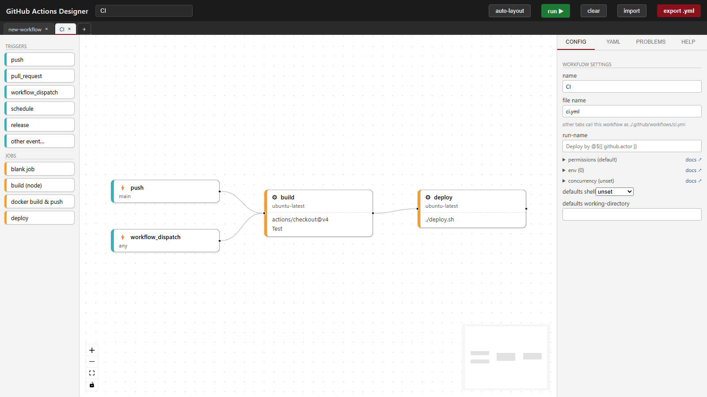
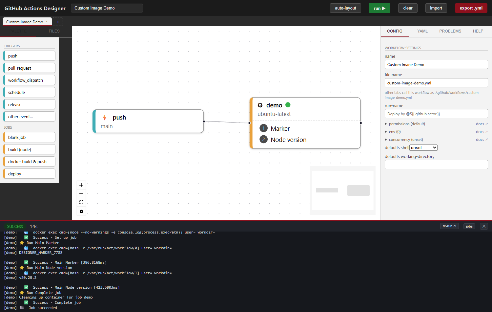

# GitHub Actions Designer

[](https://github.com/petarvucetin/gha-designer/actions/workflows/ci.yml)

Visually design GitHub Actions workflows on a DAG canvas — and run them locally
against Docker, Podman, or a full Ubuntu VM, without pushing to GitHub first.

## Screenshots





## Features

- **Drag-and-drop DAG canvas** for triggers, jobs, and steps, with one-click auto-layout (dagre).
- **Two-way YAML round-trip**: edit visually or edit the YAML tab; both stay in sync.
- **Validation + a Problems panel** that surfaces workflow errors as you edit.
- **Multi-workflow tabs**, plus a folder mode that edits `.github/workflows/` in place on disk, with external-change detection (reload/conflict handling if a file changes outside the app).
- **Actions palette** with common presets, add-by-reference for any marketplace action or reusable workflow, and drag-and-drop (or drop a GitHub/marketplace link straight onto the canvas).
- **Local execution via [nektos/act](https://github.com/nektos/act)** against Docker, Podman, or an opt-in SSH-reachable Ubuntu VM engine.
- **Live per-step run logs**, with artifact server and `actions/cache`-style caching supported by the run.
- **Guided setup** that walks a fresh machine from "nothing installed" to a first successful run (detects act/Docker/Podman, offers install/start actions).
- **Packaged desktop app** (Tauri 2): a single installer that bundles `act` as a sidecar, no separate install required.

## Status / known limitations

- **Windows-first.** Developed and packaged on Windows 11; other platforms are untested. CI (`.github/workflows/ci.yml`) accordingly runs only on `windows-latest` — the test suite hard-codes Windows path semantics (e.g. `C:\...` absolute-path detection, `where`/`.exe` engine lookups) that don't hold on Linux.
- **Comment loss on save.** A bound workflow file is re-emitted as canonical YAML, so hand-written comments in `.github/workflows/*.yml` are not preserved across a save.
- **One run at a time.** Starting a new run while one is active either fails (409) or cancels the in-flight run, depending on the request.
- **`uses:` actions are fetched live.** Marketplace actions referenced in a workflow are resolved from github.com at run time by `act`, not vendored.

## Getting started

### Prerequisites

- Node.js and npm.
- [act](https://github.com/nektos/act) on `PATH` (`winget install nektos.act`) for local runs.
- Docker Desktop or Podman, for container-based runs.

### Web dev flow

```
npm install
npm run dev:all
```

This starts the Vite dev server (`http://127.0.0.1:5173`) and the runner API (`http://127.0.0.1:7791`) together; the dev server proxies `/api` to the runner. Open `127.0.0.1:5173` in a browser.

### Desktop dev (Tauri)

```
npm run build:sidecar
npm run dev -- --port 5174
npm run tauri:dev
```

Run `build:sidecar` once first — the Rust shell spawns that sidecar binary on
startup, so it must already exist. `tauri.conf.json` sets `devUrl` to
`http://127.0.0.1:5174` but has no `beforeDevCommand`, so `tauri:dev` waits for a
dev server at that URL rather than starting one itself: run `npm run dev -- --port
5174` in its own terminal, then `npm run tauri:dev` in another. Tauri prints
"Waiting for your frontend dev server to start on http://127.0.0.1:5174/" until
the Vite server answers, then builds and launches the native window, which spawns
the sidecar for you (no separate `npm run server` needed).

### Desktop build

```
npm run build:sidecar
npm run tauri:build
```

`build:sidecar` compiles the runner into a self-contained binary (needs [bun](https://bun.sh)) and stages `act` from `PATH` as a second sidecar, so the resulting installer is self-contained. Also needs a Rust toolchain (for `tauri build`) and `act` on `PATH` at build time.

### Engines

- **Docker** or **Podman**: install one and the app detects it automatically (guided setup helps here).
- **VM engine** (opt-in): point the app at a prebuilt Ubuntu VM by setting `VM_SSH_TARGET` and `VM_SSH_KEY`. See `vm/` for the Packer/Hyper-V build that produces that VM.

## Tests

```
npm test
npx tsc -b
```

## License

MIT — see [LICENSE](LICENSE). The packaged desktop build also redistributes third-party binaries (`act`, plus the Bun-based runner sidecar); see [THIRD_PARTY_LICENSES.md](THIRD_PARTY_LICENSES.md) for details.
